÷
---

# Azure Identity Security Architecture

Azure identity security was implemented using Microsoft Entra ID and Azure RBAC.

Components configured in this lab:

- Entra ID Users and Groups
- Azure RBAC role assignments
- Conditional Access with MFA
- Privileged Identity Management (PIM)
- Self-Service Password Reset (SSPR)
- App Registration
- Managed Identity
- Azure Key Vault access
- Identity Protection policies

---

# Azure Identity Security Implementation

---

# AWS Identity Security Implementation

## IAM Users

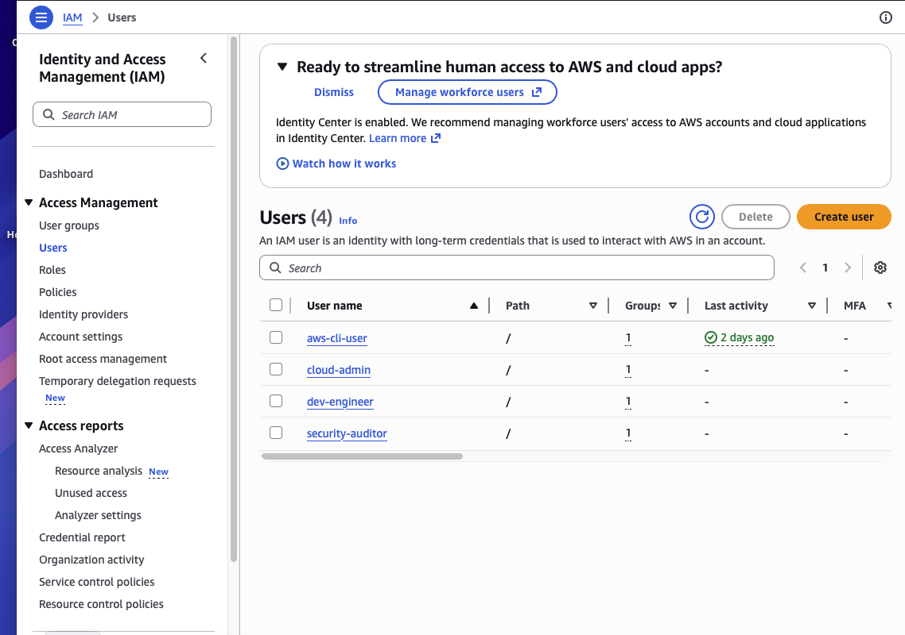

---

## IAM Groups

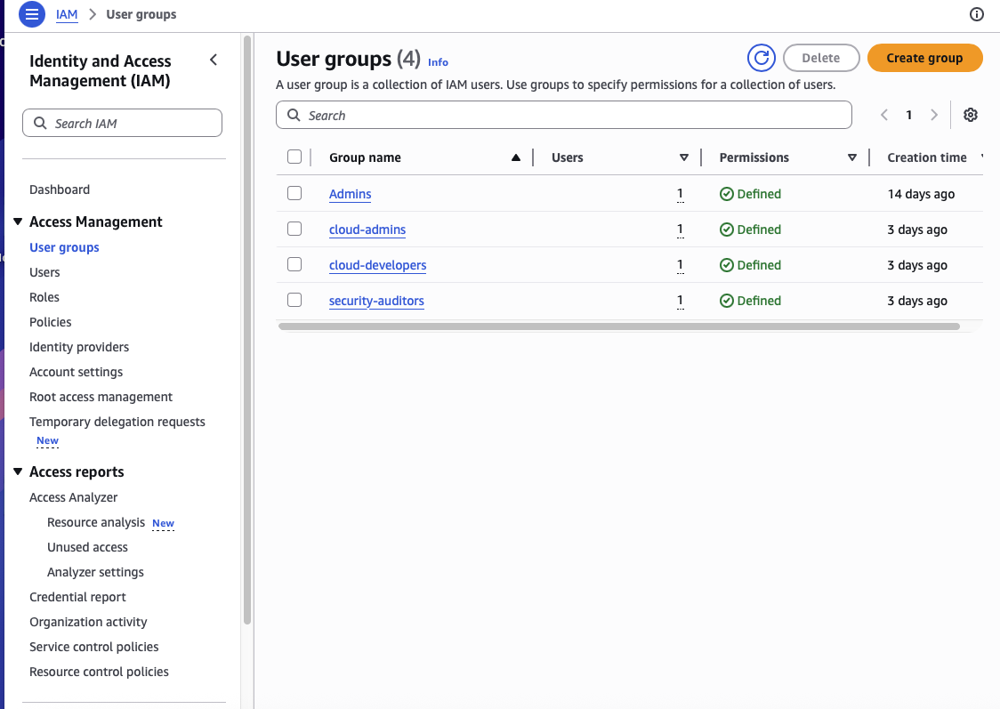

---

## Cloud Admin Permissions

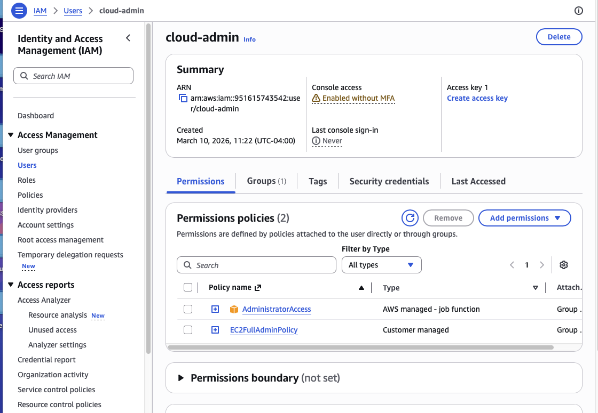

---

## Custom IAM Policy

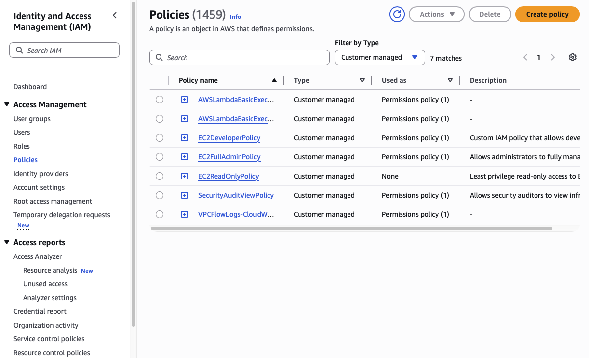

---

## EC2 Read Only Policy

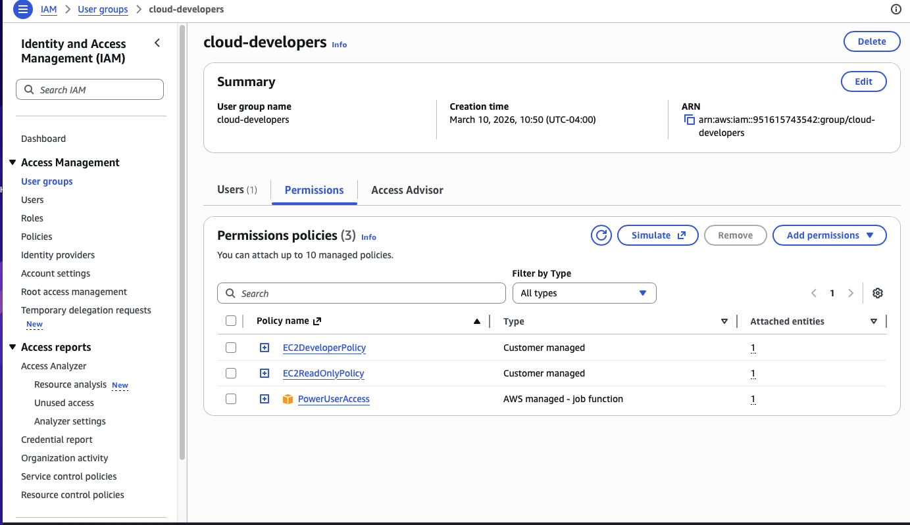

---

## IAM Role for EC2

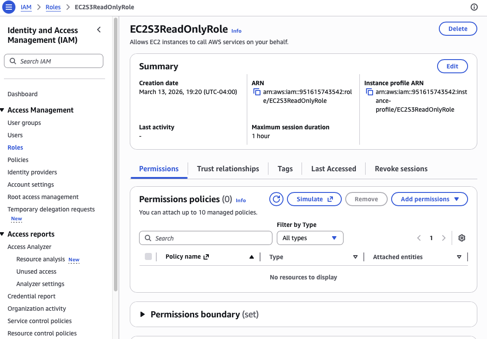

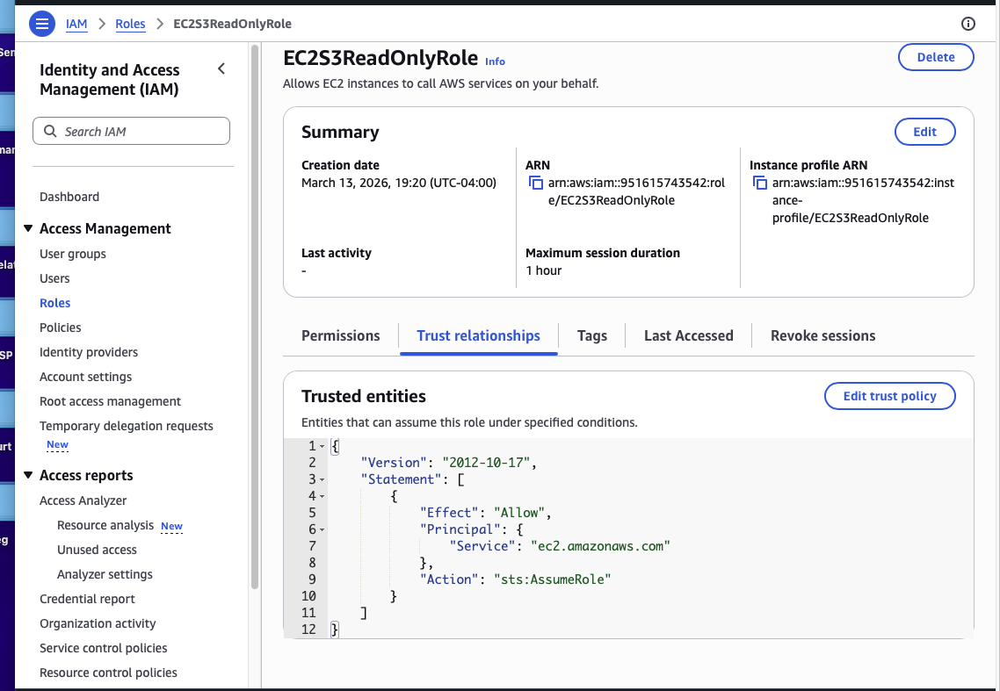

---

## STS AssumeRole

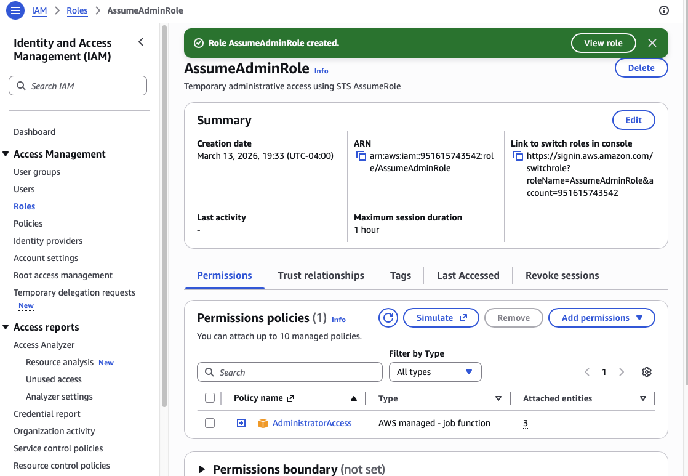

---

## AWS Secrets Manager

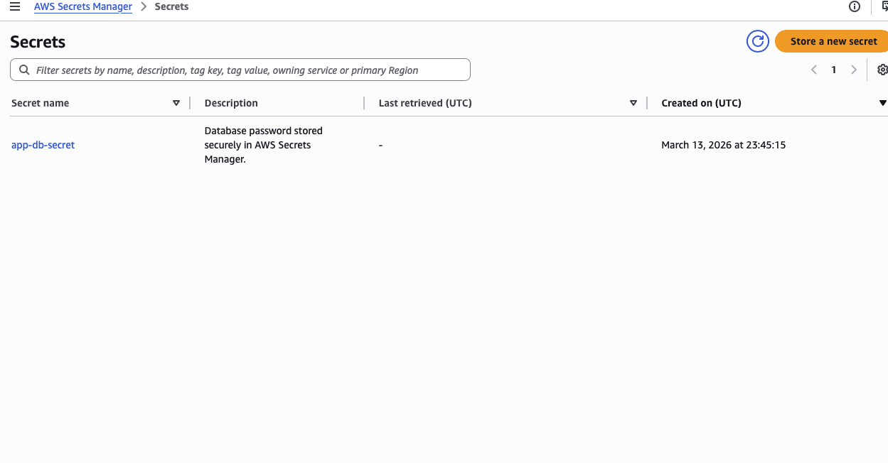

---

## IAM Access Analyzer

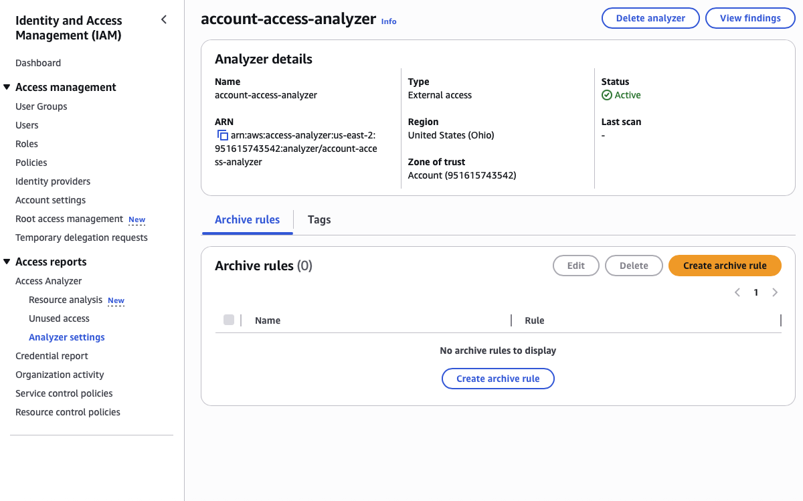

---

## IAM Credential Security

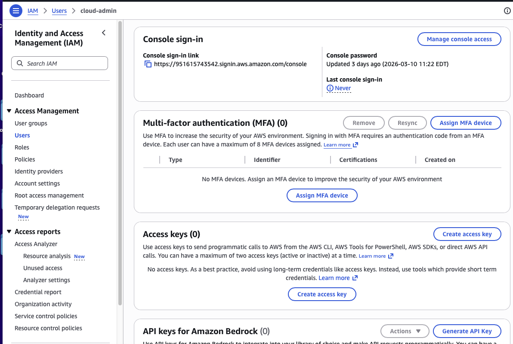

---

## Permission Boundaries

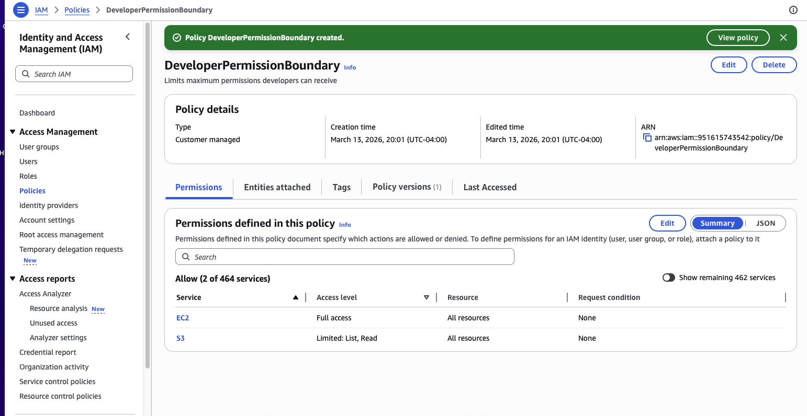

Components configured in this lab:

- IAM Users
- IAM Groups
- IAM Policies
- Custom JSON Policies
- IAM Roles
- STS AssumeRole
- Secrets Manager
- IAM Access Analyzer
- Permission Boundaries

---

# Security Concepts Demonstrated

Authentication Security
- Multi-factor authentication
- Conditional Access policies

Privileged Access Management
- Just-In-Time access
- Temporary credentials

Authorization
- Role-Based Access Control
- IAM policy evaluation
- Permission boundaries

Workload Identity
- Azure Managed Identity
- AWS IAM Roles

Secret Protection
- Azure Key Vault
- AWS Secrets Manager

Identity Monitoring
- AWS Access Analyzer
- Azure Identity Protection

---

# Technologies Used

Azure
- Microsoft Entra ID
- Azure RBAC
- Conditional Access
- Privileged Identity Management
- Managed Identity
- Azure Key Vault
- Identity Protection

AWS
- IAM Users
- IAM Groups
- IAM Policies
- IAM Roles
- AWS STS
- AWS Secrets Manager
- IAM Access Analyzer
- Permission Boundaries

